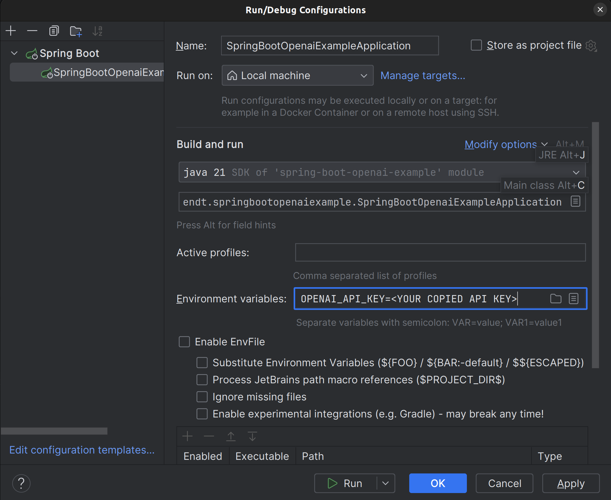
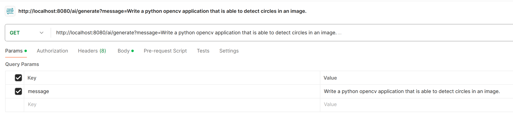
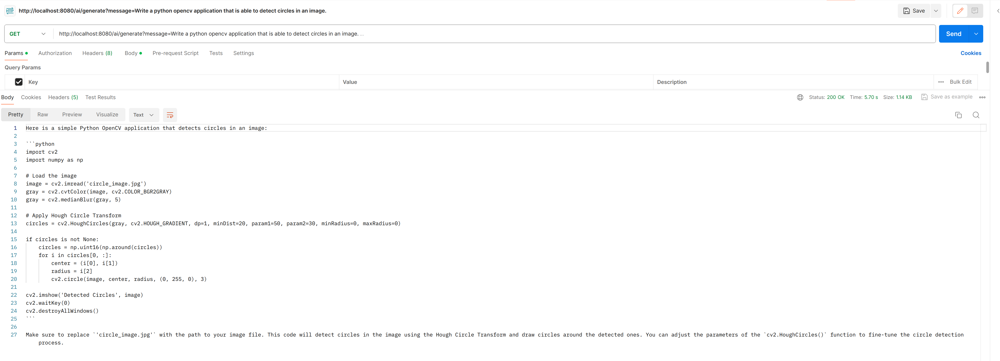

# Spring Boot OpenAi Example

Follow along with this tutorial to see how this RestAPI works
with OpenAi as a Service.

You will need the following things to use this program:

- IntelliJ IDEA or a similar IDE to run Spring Boot applications
- Java 17 installed
- Postman

### Generate Token

1. Go to https://platform.openai.com/api-keys and log in with your OpenAi Account. If you
haven't got an account yet, just create one for free.
2. Click the "+ Create new secret key" button.
3. (optional) Give your secret key a name.
3. Click on "Create secret key".
4. Copy the secret key to your clipboard. You will be only able to do this once.
5. Add the Key to your environment Variables in your Run Configuration:

### Run and use the application

1. Run your application. It will run on http://localhost:8080
2. Open Postman and create a new GET-Request
3. Insert the Request URL http://localhost:8080/ai/generate
4. Go to "Params"-Section
5. Add the key "message" with your message to ChatGPT.

6. Send your Request and watch your Response as JSON-Object.

